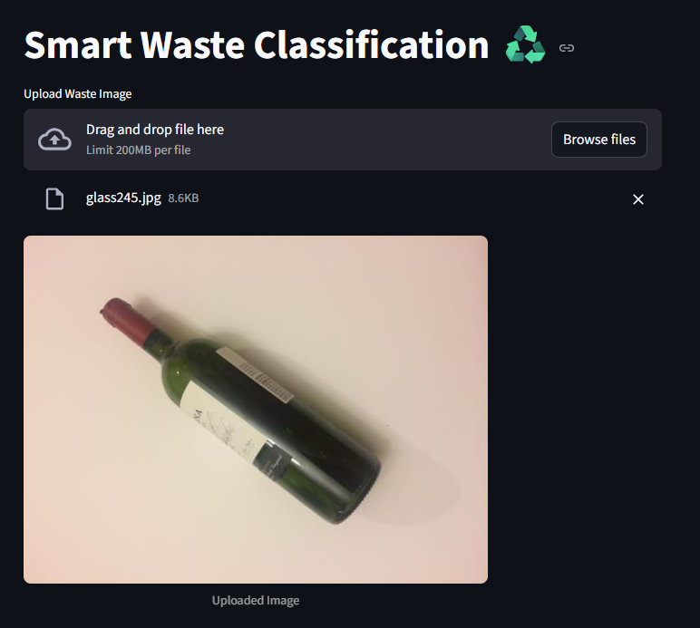
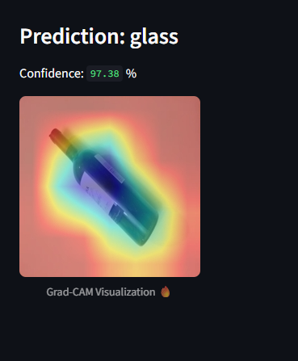
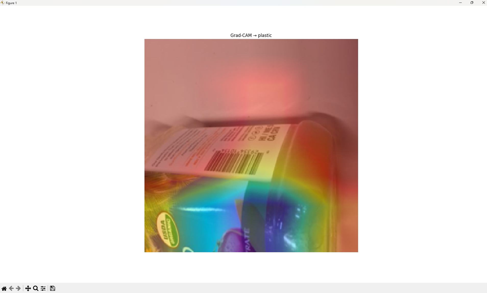

# ♻️ Smart Waste Classification using Computer Vision

An end-to-end Computer Vision system designed to assist automated waste segregation by classifying waste images into multiple categories using Deep Learning.

---

## Problem Statement

Improper waste segregation is a major environmental challenge. Manual sorting is inefficient, error-prone, and difficult to scale. This project aims to develop an intelligent vision-based system capable of identifying waste categories to support sustainable disposal practices.

---

## Solution Overview

This system leverages **Transfer Learning** with MobileNetV2 to classify waste images into:

• Cardboard  
• Glass  
• Metal  
• Paper  
• Plastic  
• Trash  

The model is integrated into an interactive **Streamlit web application** for real-time inference.

---

## Model Architecture

• Backbone: **MobileNetV2 (Pretrained)**  
• Framework: **PyTorch**  
• Technique: **Transfer Learning + Fine-tuning**  
• Input Resolution: **224 × 224**  

Why MobileNetV2?

✔ Lightweight  
✔ Fast inference  
✔ Suitable for real-time applications  
✔ Edge-device friendly

---

## Explainability (Grad-CAM)

To enhance model interpretability, **Grad-CAM visualization** was implemented.

This allows inspection of:

✔ Regions influencing model decisions  
✔ Model attention behavior  
✔ Prediction transparency  

---

## Interactive Web Application

Features:

✔ Image Upload Interface  
✔ Real-time Prediction  
✔ Confidence Score  
✔ Grad-CAM Heatmap Visualization  

---

## Results

• Validation Accuracy: **~80%**  
• Robust classification across multiple waste types  
• Demonstrated effective generalization using data augmentation

---

## Tech Stack

• Python  
• PyTorch  
• TorchVision  
• Streamlit  
• OpenCV  
• NumPy  
• Matplotlib  

---

## Project Structure

SmartWasteCV/

- train.py → Model training  
- predict.py → Inference engine  
- gradcam.py → Explainability module  
- app.py → Streamlit UI  
- waste_model.pth → Trained model  

---

## Future Improvements

• Larger & more diverse datasets (TACO Dataset)  
• Object Detection (YOLO-based Smart Bin)  
• Edge Deployment (Raspberry Pi / Jetson Nano)  
• Multi-label classification  

---

## Key Learnings

✔ Transfer Learning  
✔ Model Fine-tuning  
✔ CNN Optimization  
✔ Model Interpretability  
✔ ML System Deployment  

---

##  Demo Preview

###  Streamlit Inference Interface

---

### 🔬 Grad-CAM Interpretability

---
---

## Author

Developed as part of practical exploration in Computer Vision & Applied AI.